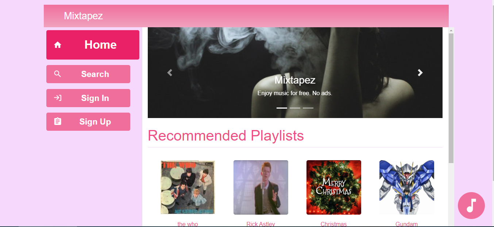

In the root folder, npm install 
In the client/ folder, npm install 
In the server/ folder, npm install 

After all installations are finished, go to root folder, npm run start-local

https://mixtapez416.herokuapp.com/

## Mixtapez
A Spotify-like web app that users can create playlists with songs that are get through Spotify’s API
* Built with React, MongoDB, Express, Node.js, Socket.io
* Users can create/edit/delete playlists, also see other's public playlists
* Can actually load and play songs from Spotify (30 seconds demo)
* In-built social media system, users can add/delete friends, chat with friends in real time, share playlists to other social media
